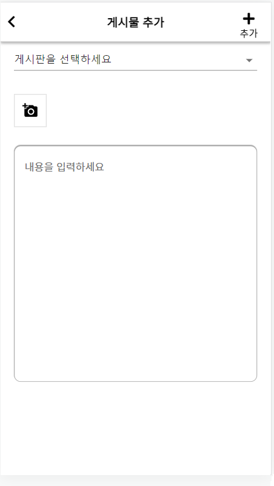
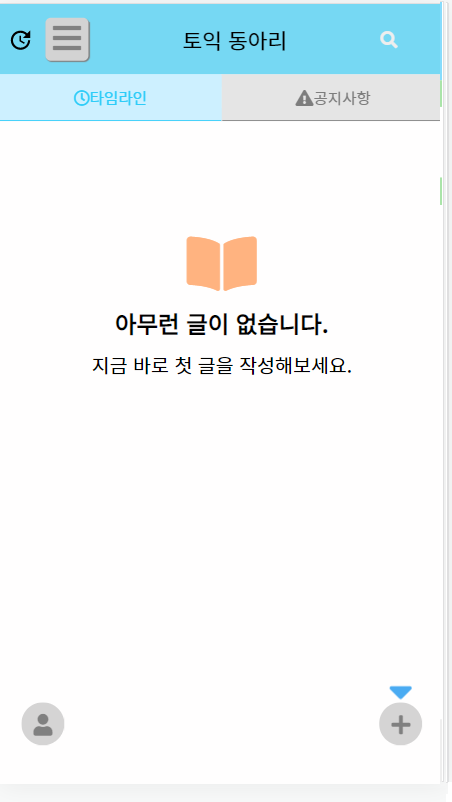

# 삼육대학교 SW프로젝트 - 팀프로젝트 밀착관리 앱

## 팀원: 박건형(팀장), 김명진, 하동호, 백정훈

## 프론트 엔드: 박건형, 김명진

## 백엔드: 하동호, 백정훈

## 프레임워크: ReactJS, JavaScript, NodeJS, Express, MySQL
## 플렛폼: Web (Chrome V8 Engine)

# 사용 방법(서버와 클라이언트 같이 사작하는 방법)

- 경로: ./server
- 명령어: yarn dev

## 데이터베이스와 테이블은 test.zip 파일 압축해제해서 사용할 것

## 와이어프레임

## 메뉴구성도

## 서비스 구성도

# 진행 상황

- [x] 자체 인증처리
- [x] 채팅(그룹)
- [ ] 로그인api
- [x] aws ec2(호스팅 및 데이터베이스 세팅)
- [x] https 적용하기
- [x] 도메인 사기
- [ ] FCM 적용하기
- [x] PWA 적용하기
